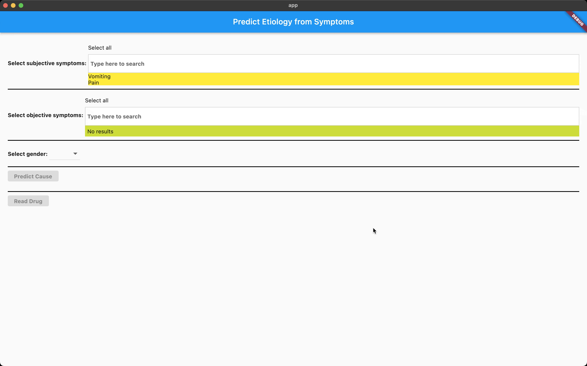

# medicine-prescriber-prototype

[](https://github.com/ai-hospital-services/medicine-prescriber-prototype/actions/workflows/build_backend.yml)
[](https://github.com/ai-hospital-services/medicine-prescriber-prototype/actions/workflows/build_frontend.yml)
[](https://codecov.io/gh/ai-hospital-services/medicine-prescriber-prototype)
[](https://github.com/psf/black)
[](/LICENSE)

> Medicine prescriber prototype for AI-HOSPITAL.SERVICES



Table of Contents:
- [medicine-prescriber-prototype](#medicine-prescriber-prototype)
  - [Repository map](#repository-map)
  - [Built with](#built-with)
  - [Getting started](#getting-started)
    - [Prerequisites](#prerequisites)
    - [Run machine learning experiments](#run-machine-learning-experiments)
    - [Run backend api locally](#run-backend-api-locally)
    - [Setup prerequisites in google kubernetes engine](#setup-prerequisites-in-google-kubernetes-engine)
    - [Setup backend api in google kubernetes engine](#setup-backend-api-in-google-kubernetes-engine)
    - [Setup frontend app in google kubernetes engine](#setup-frontend-app-in-google-kubernetes-engine)
    - [Setup kubeflow machine learning pipeline](#setup-kubeflow-machine-learning-pipeline)
    - [Run tests](#run-tests)
  - [Authors](#authors)
  - [📝 License](#-license)


## Repository map
```text
 📌 -------------------------------> you are here
┬
├── .deploy   ---------------------> deployment related code
│   ├── clusters   ----------------> contains fluxcd helm releases pipeline as code for gitops based CD
│   └── helm   --------------------> contains Helm charts for Kubernetetes workloads - backend api and frontend app
│── .github   ---------------------> github related workflows
│   └── workflows   ---------------> contains code for running github workflows for CI and docker build and publish to GCR
│── .vscode   ---------------------> visual studio code debug configuration
│── backend   ---------------------> backend
│   └── api   ---------------------> contains Python code for running backend api
│   └── test   --------------------> contains Pytest code for testing application workloads in Google Kubernetes Engine (GKE)
│── frontend/app   ----------------> contains Dart code for Flutter based frontend app
│── machine_learning   ------------> machine learning experiments and training
│   └── experiments   -------------> contains Jupyter notebook for Tensorflow based DNN training experiment
│   └── pipelines/training   ------> contains Kubeflow pipeline code for running machine learning training workflow
│── media   -----------------------> contains images
```


## Built with
- Flutter v3
- Python v3.9 & Flask v2.2
- MongoDB v6
- Docker
- Kubernetes & Helm chart
- Flux CD v0.34
- ingress-nginx controller v4.2.5
- cert-manager for letsencrypt v1.9.1
- Kubeflow standalone pipelines v1.8.5
- Tensorflow v2


## Getting started
To get a local copy up and running, follow these simple example steps.

### Prerequisites
- Install python 3.9.13: https://www.python.org/downloads/release/python-3913/
- Install jupyter notebook: https://jupyter.org/install
- Install docker desktop: https://docs.docker.com/get-docker/
- Install local kubernetes by docker desktop: https://docs.docker.com/desktop/kubernetes/
- Install helm: https://helm.sh/docs/intro/install/
- Install gcloud cli: https://cloud.google.com/sdk/docs/install
```sh
# create a virtual environment
# assuming you have "python3 --version" = "Python 3.9.13" installed in the current terminal session
python3 -m venv ./venv

# activate virtual environment
source ./venv/bin/activate

# upgrade pip
python -m pip install --upgrade pip

# install python dependencies
pip install -r ./backend/api/requirements.txt -r ./backend/api/requirements_dev.txt

# lint python code
pylint ./backend/api
```
Make sure you've configured oauth2 tenant like from `Auth0` or any other, to enable access tokens for backend api.
Use the postman collection in `backend/ai-hospital.services.postman_collection.json` to run queries thereafter.

### Run machine learning experiments
```sh
# change directory
cd machine_learning/experiments/tensorflow

# make sure the data file is available in 'data' subdirectory
mkdir data
cp <DATA SOURCE DIRECTORY>/data.psv data/

# run the jupyter notebook - tensorflow_dnn.ipynb
jupyter notebook tensorflow_dnn.ipynb

# check the machine learning output
ls data
>>> causes_tokeniser.json  data.psv  model.h5  symptoms_tokeniser.json
```

### Run backend api locally
```sh
# change directory
cd backend

# argument --debug-mode = true or false (default) to enable debug mode logging
FLASK_DEBUG=1 python -m api.app --debug-mode true --port 8080

# curl to hit backend api
curl http://localhost:8080
>>> Welcome to backend api!
```

### Setup prerequisites in google kubernetes engine
Make sure to setup the backend infrastructure on google cloud by following instructions:
- Terraform: https://github.com/ai-hospital-services/infrastructure-as-code#setup-backend-infrastructure
- Kube config context: https://github.com/ai-hospital-services/infrastructure-as-code#setup-kube-config-context
- MongoDB: https://github.com/ai-hospital-services/infrastructure-as-code#setup-mongodb-database

Setup a google cloud dns with the public ip address in google cloud created by terraform - `<PREFIX>-<ENVIRONMENT>-app-ip01`

Install NGINX ingress controller
```sh
# change directory
cd .deploy/helm

# prepare the 'nginx-ingress-values-secret.yaml'
touch nginx-ingress-values-secret.yaml

# update the 'nginx-ingress-values-secret.yaml' file like the following, where,
# controller:
#   service:
#     externalTrafficPolicy: "Local"
#     loadBalancerIP: "<LOAD BALANCER IP>"
#   nodeSelector: {"kubernetes.io/arch": "arm64"}
#   tolerations: [{key: "kubernetes.io/arch", value: "arm64"}]
#   admissionWebhooks:
#     patch:
#       nodeSelector: {"kubernetes.io/arch": "arm64"}
#       tolerations: [{key: "kubernetes.io/arch", value: "arm64"}]
# defaultBackend:
#   nodeSelector: {"kubernetes.io/arch": "arm64"}
#   tolerations: [{key: "kubernetes.io/arch", value: "arm64"}]

# to override arm64 node selection and tolerations, replace with,
# nodeSelector: {}
# tolerations: []

# note:
# - <LOAD BALANCER IP> is the public ip address in google cloud created by terraform - <PREFIX>-<ENVIRONMENT>-app-ip01

# install/upgrade helm chart
helm upgrade -i ingress-nginx ingress-nginx \
  --repo https://kubernetes.github.io/ingress-nginx \
  --namespace ingress-nginx \
  --create-namespace \
  --version 4.2.5 \
  -f nginx-ingress-values.yaml \
  -f nginx-ingress-values-secret.yaml

# if you want to stop and remove helm chart and namespace
helm delete -n ingress-nginx ingress-nginx
kubectl delete namespace ingress-nginx
```

Install cert-manager for letsencrypt ssl certificate generation
```sh
# install/upgrade helm chart
helm upgrade -i cert-manager cert-manager \
    --repo "https://charts.jetstack.io" \
    --namespace cert-manager \
    --create-namespace \
    --version v1.9.1 \
    -f cert-manager-values.yaml --dry-run

# if you want to stop and remove helm chart and namespace
helm delete -n cert-manager cert-manager
kubectl delete namespace cert-manager
```

Install flux cd
```sh
# change directory
cd .deplpoy/clusters/gke01

# install flux system
kubectl apply -f flux-system/flux-system.yaml

# create ssh key for flux to authenticate to github
flux create secret git medicine-prescriber-prototype-auth \
  --url=ssh://git@github.com/ai-hospital-services/medicine-prescriber-prototype \
  --ssh-key-algorithm=ecdsa \
  --ssh-ecdsa-curve=p521 \
  --export > medicine-prescriber-prototype-flux-auth-secret.yaml

# install github ssh key as secret
kubectl apply -f medicine-prescriber-prototype-flux-auth-secret.yaml

# add the above generated ssh key in 'medicine-prescriber-prototype-flux-auth-secret.yaml' to your github.com > settings > SSH keys

# create git source in flux
kubectl apply -f medicine-prescriber-prototype-source.yaml
```

### Setup backend api in google kubernetes engine
```sh
# make sure the docker image for backend api has been built with image tag for GCR in Asia, like,  
# asia.gcr.io/<PREFIX>-<ENVIRONMENT>/backend-api:<VERSION>
# matching <VERSION> from the 'appVersion' value in '.deploy/backend-api/Chart.yaml'
docker build -t asia.gcr.io/<PREFIX>-<ENVIRONMENT>/backend-api:<VERSION> backend/api

# push docker image
gcloud auth configure-docker
docker push asia.gcr.io/<PREFIX>-<ENVIRONMENT>/backend-api:<VERSION>

# change directory
cd .deplpoy/clusters/gke01

# create machine learning output secret and 'backend' namespace
mkdir backend/data
cp ../../../machine_learning/experiments/data/ backend/data/
kubectl apply -k backend

# prepare the '../../helm/backend-api/values-secret.yaml'
touch ../../helm/backend-api/values-secret.yaml

# update the '../../helm/backend-api/values-secret.tfvars' file like the following, where,
# image:
#   repository: "asia.gcr.io/<PREFIX>-<ENVIRONMENT>/backend-api"
# config:
#   mongodbURL: "mongodb://<MONGODB APP USERNAME>:<MONGODB APP PASSWORD>@mongodb.mongodb:27017/ai_hospital_services?authMechanism=DEFAULT&authSource=ai_hospital_services"
#   tenantDomain: "<TENANT DOMAIN>"
#   redirectURL: "<REDIRECT URL>"
#   clientID: "<CLIENT ID>"
#   clientSecret: "<CLIENT SECRET>"
#   hosts:
#     - host: <API DOMAIN NAME>
#       paths:
#         - path: /
#           pathType: Prefix
#   tls:
#    - secretName: api-ai-hospital-services-tls
#      hosts:
#        - <API DOMAIN NAME>
# letsencrypt:
#   enabled: true
#   email: "<DOMAIN EMAIL ADDRESS>"
#   mode: "production"

# to override arm64 node selection and tolerations, add,
# nodeSelector: {}
# tolerations: []

# note:
# - <TENANT DOMAIN> = oauth2 tenant domain
# - <REDIRECT_URL> = oauth2 redirect url
# - <CLIENT ID> = oauth2 client id
# - <CLIENT SECRET> = oauth2 client secret
# - <API DOMAIN NAME> = backend api domain name to be configured in google cloud dns
# - <DOMAIN EMAIL ADDRESS> = domain email address for letsencrypt

# create helm release values file as secret
kubectl -n flux-system create secret generic values-backend-api \
  --from-file=values.yaml=../../helm/backend-api/values-secret.yaml

# create helm release for backend api
kubectl apply -f backend/backend-api-release.yaml

# watch the helm release deploy
flux get helmreleases --watch

# if you want to stop and remove helm release and namespace
kubectl delete -f backend/backend-api-release.yaml
kubectl delete -k backend

# configure the google cloud dns by adding an 'A' record for the <API DOMAIN NAME>
```

### Setup frontend app in google kubernetes engine
Make sure to setup the backend api by following the instructions in previous section
```sh
# make sure the docker image for frontend app has been built with image tag for GCR in Asia, like,  
# asia.gcr.io/<PREFIX>-<ENVIRONMENT>/frontend-app:<VERSION>
# matching <VERSION> from the 'appVersion' value in '.deploy/frontend-app/Chart.yaml'
docker build -t asia.gcr.io/<PREFIX>-<ENVIRONMENT>/frontend-app:<VERSION> frontend/app

# push docker image
gcloud auth configure-docker
docker push asia.gcr.io/<PREFIX>-<ENVIRONMENT>/frontend-app:<VERSION>

# change directory
cd .deplpoy/clusters/gke01

# create 'froontend' namespace
kubectl apply -k frontend

# prepare the '../../helm/frontend-app/values-secret.yaml'
touch ../../helm/frontend-app/values-secret.yaml

# update the '../../helm/frontend-app/values-secret.yaml' file like the following, where,
# image:
#   repository: "asia.gcr.io/<PREFIX>-<ENVIRONMENT>/frontend-app"
# config:
#   backendAPIURL: "<BACKEND END API URL>"
#   authoriseURL: "<TENANT AUTHORIZE ENDPOINT URL>"
#   redirectURL: "<REDIRECT URL>"
#   audience: "<TENANT AUDIENCE API>"
#   clientID: "<CLIENT ID>"
#   hosts:
#     - host: <APP DOMAIN NAME>
#       paths:
#         - path: /
#           pathType: Prefix
#   tls:
#    - secretName: app-ai-hospital-services-tls
#      hosts:
#        - <APP DOMAIN NAME>
# letsencrypt:
#   enabled: true
#   email: "<DOMAIN EMAIL ADDRESS>"
#   mode: "production"

# to override arm64 node selection and tolerations, add,
# nodeSelector: {}
# tolerations: []

# note:
# - <BACKEND END API URL> = backend api url configured in the google cloud dns
# - <TENANT AUTHORIZE ENDPOINT URL> = oauth2 tenant authorize endpoint url
# - <REDIRECT_URL> = oauth2 redirect url
# - <CLIENT ID> = oauth2 client id
# - <CLIENT SECRET> = oauth2 client secret
# - <APP DOMAIN NAME> = frontend app domain name to be configured in google cloud dns
# - <DOMAIN EMAIL ADDRESS> = domain email address for letsencrypt

# create helm release values file as secret
kubectl -n flux-system create secret generic values-frontend-app \
  --from-file=values.yaml=../../helm/frontend-app/values-secret.yaml

# create helm release for backend api
kubectl apply -f frontend/frontend-app-release.yaml

# watch the helm release deploy
flux get helmreleases --watch

# if you want to stop and remove helm release and namespace
kubectl delete -f frontend/frontend-app-release.yaml
kubectl delete -k frontend

# configure the google cloud dns by adding an 'A' record for the <APP DOMAIN NAME>
```

### Setup kubeflow machine learning pipeline
Reference:
- https://www.kubeflow.org/docs/components/pipelines/v1/installation/standalone-deployment/
- https://www.kubeflow.org/docs/components/pipelines/v1/sdk/install-sdk/
- https://www.kubeflow.org/docs/distributions/gke/pipelines/authentication-pipelines/

Make sure the data file is uploaded to the google cloud storage bucket - `<PREFIX>-<ENVIRONMENT>-storagebucket01` as `data.psv`.

```sh
# enable prerequisite google cloud services
gcloud services enable \
  serviceusage.googleapis.com \
  compute.googleapis.com \
  container.googleapis.com \
  iam.googleapis.com \
  servicemanagement.googleapis.com \
  cloudresourcemanager.googleapis.com \
  ml.googleapis.com \
  iap.googleapis.com \
  sqladmin.googleapis.com \
  meshconfig.googleapis.com \
  krmapihosting.googleapis.com \
  servicecontrol.googleapis.com \
  endpoints.googleapis.com \
  iamcredentials.googleapis.com

# install kubeflow standalone pipeline runtime
export PIPELINE_VERSION=1.8.5
kubectl apply -k "github.com/kubeflow/pipelines/manifests/kustomize/cluster-scoped-resources?ref=$PIPELINE_VERSION"
kubectl wait --for condition=established --timeout=60s crd/applications.app.k8s.io
kubectl apply -k "github.com/kubeflow/pipelines/manifests/kustomize/env/platform-agnostic-pns?ref=$PIPELINE_VERSION"

# build machine learning dependencies docker image
cd machine_learning/pipelines/training
docker build -t asia.gcr.io/<PREFIX>-<ENVIRONMENT>/machine_learning_training:tensorflow_dnn .

# push docker image
gcloud auth configure-docker
docker push asia.gcr.io/<PREFIX>-<ENVIRONMENT>/machine_learning_training:tensorflow_dnn

# install kubeflow pip dependencies
pip install kfp --upgrade

# apply role binding for kubeflow 'pipeline-runner' service account to create secrets in 'backend' namespace
kubectl apply secretsrolebinding.yaml

# port forward from kubeflow pipeline ui service
kubectl port-forward --namespace kubeflow svc/ml-pipeline-ui 3000:80

# run the training pipeline - 'Machine learning training pipeline - tensorflow dnn'
GCS_STORAGE_BUCKET_NAME="<PREFIX>-<ENVIRONMENT>-storagebucket01" \
DATA_FILE_NAME="data.psv" \
SECRET_NAME="test" \
SECRET_NAMESPACE="backend" \
  python tensorflow_dnn.py

# check the pipeline execution on browser
http://localhost:3000

# check the training output files are available in the google cloud storage bucket - '<PREFIX>-<ENVIRONMENT>-storagebucket01'
# check the secret - 'test' has been created in the 'backend' namespace

# if you want to stop and remove helm release and namespace
export PIPELINE_VERSION=1.8.5
kubectl delete -k "github.com/kubeflow/pipelines/manifests/kustomize/env/platform-agnostic-pns?ref=$PIPELINE_VERSION"
kubectl delete -k "github.com/kubeflow/pipelines/manifests/kustomize/cluster-scoped-resources?ref=$PIPELINE_VERSION"
kubectl delete -n kubeflow
```

### Run tests
```sh
# change directory
cd backend

# run unit tests
pytest -v --cov=api
```


## Authors

👤 **Ankur Soni**

- [](https://github.com/ankursoni)
- [](https://linkedin.com/in/ankursoniji)
- [](https://twitter.com/ankursoniji)


## 📝 License

This project is [Apache](./LICENSE) licensed.
